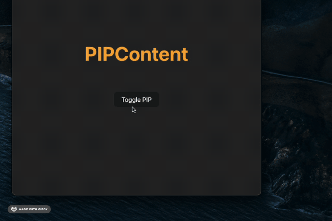

# React Document Picture-in-Picture

A React component library for creating Picture-in-Picture windows using the Document Picture-in-Picture API with styled-components support.



## Browser Support

- This feature may not work in some browsers. Browser compatibility can be checked at [CanIUse](https://caniuse.com/mdn-api_documentpictureinpicture).

- This feature is only available in [Secure Contexts](https://developer.mozilla.org/en-US/docs/Web/Security/Secure_Contexts) (HTTPS or localhost).

## Installation

```bash
npm install react-document-pip
```

## Usage

### Basic Example

```tsx
import { useState } from "react";
import DocumentPip from "react-document-pip";

function App() {
  const [isPipOpen, setIsPipOpen] = useState(false);

  const togglePip = () => {
    setIsPipOpen(!isPipOpen);
  };

  const handleClose = () => {
    setIsPipOpen(false);
  };

  return (
    <>
      <DocumentPip
        isPipOpen={isPipOpen}
        size={{ width: 500, height: 400 }}
        onClose={handleClose}
      >
        <MyComponent />
      </DocumentPip>
      <button onClick={togglePip}>Toggle PIP</button>
    </>
  );
}
```

## API Reference

### DocumentPIP Props

| Prop                           | Type                     | Default      | Description                                                                      |
| ------------------------------ | ------------------------ | ------------ | -------------------------------------------------------------------------------- |
| `children`                     | `React.ReactNode`        | -            | The content to display in the PIP window                                         |
| `isPipOpen`                    | `boolean`                | -            | Controls whether the PIP window is open                                          |
| `size`                         | `Partial<PIPWindowSize>` | -            | Size of the PIP window                                                           |
| `mode`                         | `'clone' \| 'transfer'`  | `'transfer'` | Content display mode<br>`clone`: keep original + copy<br>`transfer`: move to PIP |
| `copyAllStyles`                | `boolean`                | `true`       | Whether to copy all styles to PIP window                                         |
| `disallowReturnToOpener`       | `boolean`                | `false`      | Whether to disallow returning to the opener window                               |
| `preferInitialWindowPlacement` | `boolean`                | `false`      | Whether to prefer initial window placement                                       |
| `onClose`                      | `() => void`             | -            | Callback function when the PIP window is closed                                  |

### Types

```typescript
interface PIPWindowSize {
  width: number;
  height: number;
}

type PIPMode = "clone" | "transfer";

interface DocumentPIPProps {
  children: React.ReactNode;
  isPipOpen: boolean;
  size?: Partial<PIPWindowSize>;
  mode?: PIPMode;
  copyAllStyles?: boolean;
  disallowReturnToOpener?: boolean;
  preferInitialWindowPlacement?: boolean;
  onClose: () => void;
}
```

## Browser Support

This library uses the [Document Picture-in-Picture API](https://developer.chrome.com/docs/web-platform/document-picture-in-picture/), which is currently supported in:

- Chrome 116+
- Edge 116+
- Opera 102+

## License

MIT
